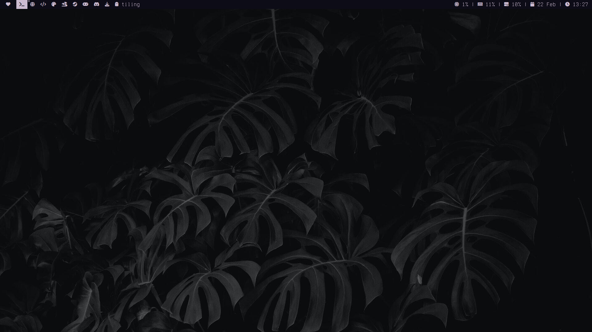
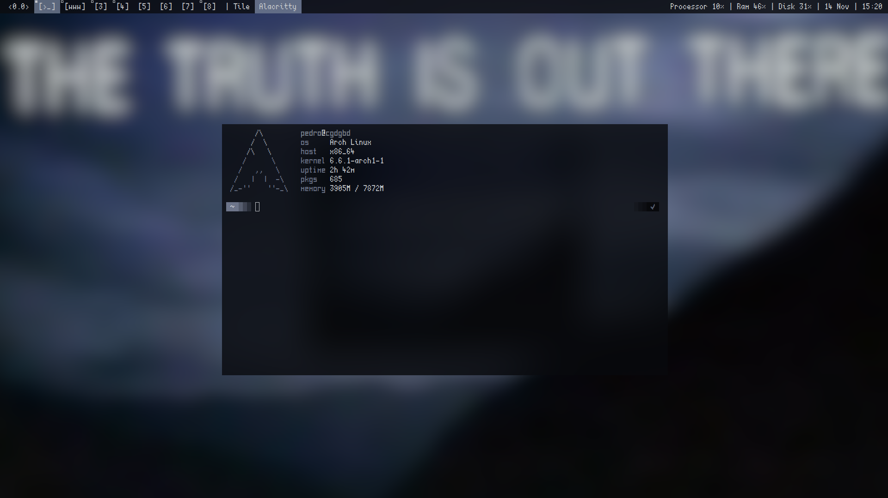

### Welcome to my dotfiles
### Everything you need, and just a little bit more

## Dependencies:

- Font 1: <a href="https://github.com/nerdypepper/scientifica"> Scientific </a>
- Font 2: <a href="https://archlinux.org/packages/extra/any/ttf-terminus-nerd/"> Terminess Nerd (not used in screenshots) </a>
- Screenshots: <a href="https://github.com/flameshot-org/flameshot"> Flameshot </a>
- Colorscheme: <a href="https://github.com/dylanaraps/pywal"> Pywal </a>
- Text Editor: <a href="https://www.gnu.org/software/emacs/"> Emacs </a>
- Statusbar: <a href="https://tools.suckless.org/slstatus/"> Slstatus </a>
- Terminal 1: <a href="https://github.com/alacritty/alacritty"> Alacritty </a>
- Terminal 2: <a href="https://st.suckless.org/"> ST </a>
- Screen Locker: <a href="https://tools.suckless.org/slock/"> Slock </a>
- Menu: <a href="https://tools.suckless.org/dmenu/"> Dmenu </a>
- Music: <a href="https://github.com/ncmpcpp/ncmpcpp"> Ncmpcpp </a>
- DWM dependencies here: <a href="https://wiki.archlinux.org/title/dwm"> Arch Wiki DWM </a>

## Screenshots:

## TODO:
- Update dwm to remove unused variables
