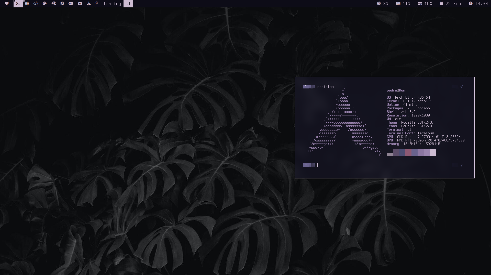
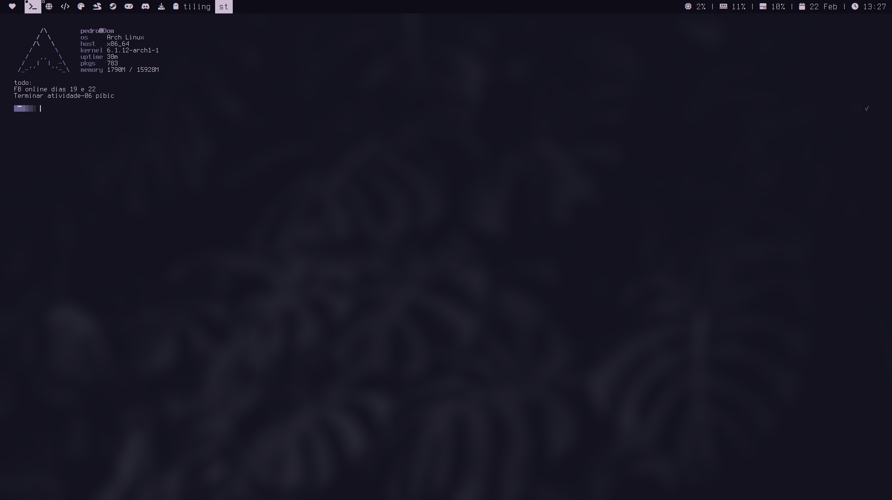
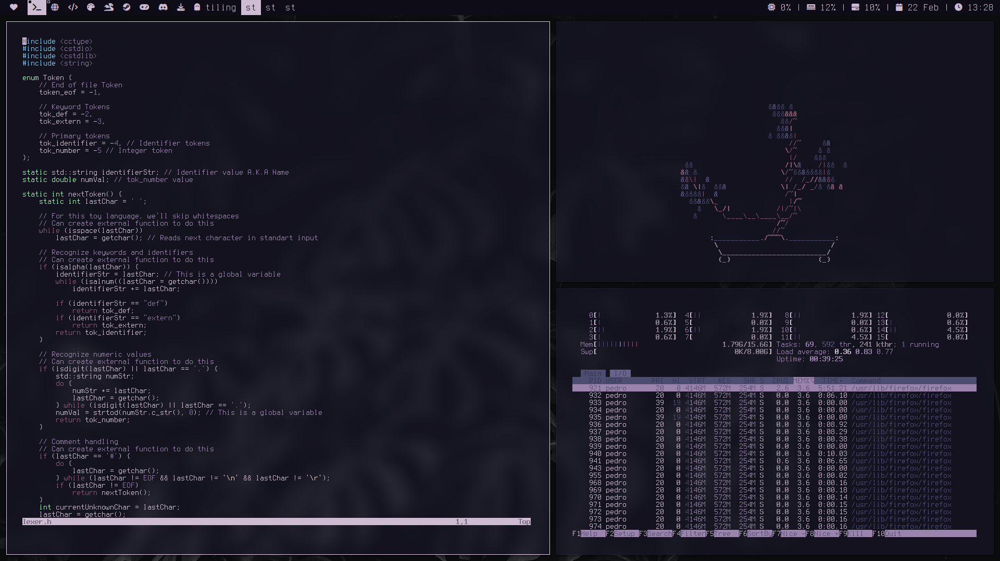
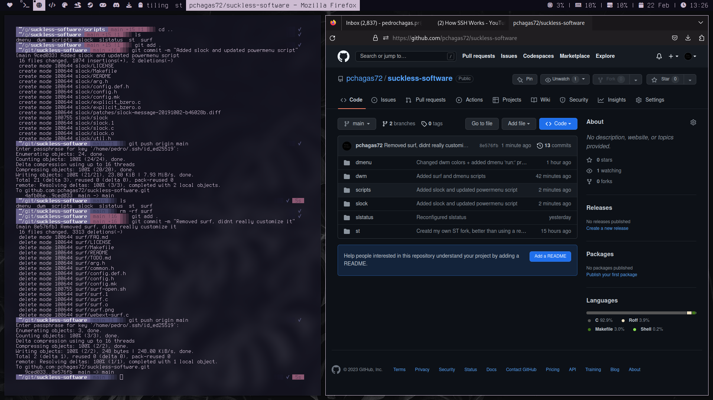

### Welcome to my suckless-software forks
#### What you'll find here:
  - Beautiful <b>dwm</b> build with the following changes:
      - Patch: Bar-height
      - Patch: Fancybar
      - Patch: Statusbutton
      - Patch: Steam fix
      - Patch: UselessGap
      - slstatus for system-tray
      - flameshot keybind
  
  - Simple yet powerful <b>dmenu</b>, with some scripts as well:
      - Patch: dmenu-center
      - powermenu script
  
  - Amazing (at least for me) <b>st</b> fork:
      - Patch: alpha-patch
      - Patch: scrollback
      - vim keys for scrollback
      
  - Unpatched, cute and useful <b>slstatus</b> config
  
  - <b>Slock</b> with one very simple patch 
      - Patch: slock-message
      - Script: LockScreen option in powermenu with cowsay
      
## Screenshots:

